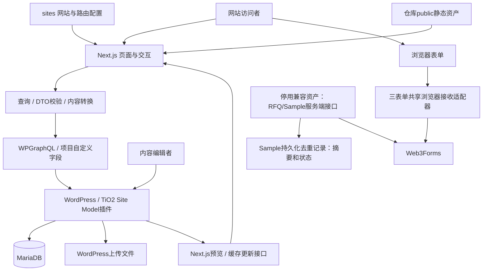

# D16 当前软件架构

本文记录网站应用、CMS、数据、表单和环境的当前软件结构。发布控制器、五类包、主体、状态、权限、备份和恢复结构单独见[发布架构](release-architecture.md)；`tio2-my` 的具体操作见[生产运行手册](production-deployment.md)。

核对依据为仓库中的代码、配置和当前合同。本文的“已实现”只表示存在对应软件结构，不表示某次测试、部署或生产验收已经完成。网站身份与限制见[网站登记](site-registry.md)和[根规则](../AGENTS.md)。

## 1. 架构概览

当前采用Headless WordPress + Next.js架构：WordPress负责内容管理、内容模型和API；Next.js负责网站路由、服务端页面呈现、浏览器交互及SEO输出。MariaDB保存CMS数据；媒体同时可能来自WordPress上传和仓库静态资产。Malaysia表单另行连接Web3Forms。

代码组织为一个共享Next.js应用和一个项目WordPress插件，不是已拆分的微服务系统。共享Next.js代码按`SITE_ID`确定一个运行实例的网站身份；共享CMS中的内容由`site_scope`等合同进行逻辑隔离。本地开发CMS与预发布CMS则使用不同数据库和文件卷进行环境隔离。



图中为主要链路，不表示所有内容一律来自CMS，也不表示所有页面都支持同一种草稿预览。Web3Forms以外的实际收件配置与最终送达需另核实。

## 2. 模块与技术边界

2026-09-13 用户已确认[CMS、前端、配置与构建职责划分](superpowers/specs/2026-09-13-cms-frontend-build-responsibilities-design.md)，作为后续改造目标：运行内容与审批证据分离，前端校验技术契约，功能配置不寄存在文案中，构建允许读取 CMS 但不重新批准文案。以下记录现有结构；目标获批不表示各读取、SEO、缓存和配置路径已经完成改造。已发现差距见[审计](verification/2026-09-13-tio2-my-content-coupling-audit.md)。

在 2026-09-13 的法律页切片时点，独立读取合同只在 `tio2-my` 三个法律页落实：PHP resolver 与 TypeScript DTO 在保留身份、结构和安全限制的同时读取实际已发布 CMS 正文，渲染及 SEO 消费该值；当时旧写入审批合同不变。彼时首页、应用、关于、联系、产品、市场、文档、资源、编辑内容及表单页等读取链仍待逐族迁移。该法律页历史范围见[内容发布说明](content-release.md)和[法律页读取回执](verification/cms-read-decoupling-legal.md)；生产未因此安装或发布。

2026-09-14 的后续局部实现已使 `tio2-my` HOME-001 与 APP-000 的读取、正文、SEO 和更新依赖脱离旧批准正文比较，并新增两页独立的技术写契约、受保护批准核验、普通 WordPress 写入服务及受控 SQL 导入适配；见[本地验证记录](verification/2026-09-14-cms-decoupling-w3-a1.md)。因此上一段“只有法律页”“首页/应用仍待迁移”仅是 2026-09-13 时点，不再代表本分支现状。首页/应用的更新仍需独立人工批准来源、完整当前/候选摘要、有效期、网站/环境与操作、真实执行 capability；技术合法或内容哈希都不是授权。适配范围仅两页；其他 MY 页面族、A/B、共享外壳、其他 SEO/缓存消费者继续按原合同。普通受控写入的提交后通知与批量维护窗口整库恢复是两条不同路径，详情见[内容发布说明](content-release.md)。这些代码与隔离测试尚未表示 `develop` 集成、生产安装或发布；网站登记的生产 `content-only` 仍为 `not-installed`。

| 模块 | 实际位置 / 技术 | 职责与边界 |
|---|---|---|
| 页面与布局 | `app/`；Next.js App Router、React、TypeScript | 路由、页面加载、布局、metadata；存在英文及其他语言的路由分组 |
| UI组件 | `components/`、`components/sites/` | 页面展示、站点外壳及交互；Client Component承担需要浏览器状态的行为 |
| 网站配置 | `sites/`、`lib/sites/current-site.ts` | 注册网站、模板/公开路由信息；缺失或未知SITE_ID报错，不默认选择另一站 |
| 内容访问 | `lib/wordpress/` | GraphQL传输、查询、类型、DTO校验、预览、缓存标签；具体页面使用对应合同 |
| 应用规则 | `lib/rfq/`、`lib/request-sample/`、`lib/request-documents/`及其他业务目录 | 输入校验、预填、payload、状态与错误映射；目录位置不等于独立后端服务 |
| SEO | `lib/seo/`及页面metadata、robots/sitemap入口 | 标题、canonical、结构化数据和索引控制；策略按站点/页面/环境区分 |
| CMS模型 | `wordpress/plugins/tio2-site-model/`；PHP | 自定义内容类型、字段、scope、发布合同、GraphQL字段、预览与更新通知 |
| 数据与媒体 | WordPress + MariaDB；uploads、`public/` | 内容记录和媒体；按站点/环境归属，不从策划本机目录读取生产数据 |
| 外部表单接收 | Web3Forms；`lib/forms/web3forms-browser.ts` | Malaysia三张活跃表单由浏览器共享传输直接调用；RFQ/Sample服务端接口作为停用兼容资产保留；服务商返回与实际收件分别验证 |
| 环境承载 | 开发Compose、预发布Compose、本地Node.js进程及`tio2-my`生产Oracle VPS | 本地环境见第7节；生产拓扑见第8节 |

这张表说明当前职责，不声称已经强制实现Clean Architecture、DDD或统一分层框架。确切依赖版本以[package-lock.json](../package-lock.json)及当次安装为准；依赖声明见[package.json](../package.json)。预发布容器使用的运行时由[Compose](../ops/prerelease/docker-compose.yml)规定，不用历史设计中的版本号推断当前版本。

## 3. 多网站与多语言

当前代码注册`tio2-a`、`tio2-b`、`tio2-my`三个网站，见[注册入口](../sites/index.ts)与[当前网站解析](../lib/sites/current-site.ts)。品牌、域名及策划归属集中在[网站登记](site-registry.md)，本文不维护第二张域名权威表。

- 一个共享代码树可以构建/启动多个网站实例；不同实例配置自己的SITE_ID和构建目录。当前入口不是根据来访Host在一个实例内任意切换网站的通用多租户平台。
- 内容隔离包括CMS归属、查询条件、DTO合同、路由、缓存标签和接收payload。代码存在校验不等于全路径隔离已验收，具体改动仍需相关测试。
- 多个网站可以使用同一个开发WordPress实例；这是一套CMS中的逻辑隔离，不是每站独立数据库，也不是已经采用WordPress Multisite。
- 共享代码不代表所有页面共用完全相同的模板，也不传播内容批准。页面、站点外壳和模板选择由当前站点配置及实现决定。
- `app/(en)`、`app/(ms)/ms`、`app/(pt-br)/pt-br`等目录组织不同语言路径；存在某语言路由不表示整站或三个网站都具备完整翻译。
- Site B业务冻结、Site A Homepage链接限制等是项目约束，见根规则；它们不是所有网站永久共用的架构限制。

## 4. 内容读取、合同与渲染

典型内容链：

```text
批准内容按任务进入受控CMS记录/代码资产
  → WordPress项目模型与网站归属
  → WPGraphQL查询
  → 响应解析、合同/DTO校验
  → Next.js服务端页面与metadata
  → 浏览器HTML及适用Client Component交互
```

[GraphQL客户端](../lib/wordpress/client.ts)使用HTTP POST，并处理超时、网络、HTTP和GraphQL错误；默认请求使用`force-cache`，可由调用者指定其他缓存策略及标签。运行配置应明确`WORDPRESS_GRAPHQL_URL`；代码中存在开发endpoint默认值不能当作生产配置。

[GraphQL Codegen](../codegen.ts)从仓库中的`wordpress/schema.graphql`和列出的查询文档生成类型。生成类型只约束开发时的接口使用，不能代替对运行数据的校验。

内容形态并非统一：既有常规GraphQL字段，也有自定义GraphQL字段返回JSON合同、再转为DTO的实现。例如[About查询](../lib/wordpress/about-page-v01-queries.ts)。因此不能假设所有页面都直接读取普通WordPress文章正文，或都使用同一组ACF字段。

仓库也保存站点配置、路由清单、页面合同JSON、seed及静态资产；部分组件直接消费这些配置。WordPress是相应动态内容的运行来源，但不是业务批准和全部网站内容的唯一来源。批准来源由策划/用户决定，运行内容按批准映射进入CMS或代码；不能因为CMS里存在一条记录就推断其已获批准。

页面渲染由具体路由决定。[首页入口](<../app/(en)/page.tsx>)是服务端加载内容、生成metadata并调用渲染组件的实例；交互表单等使用Client Component。静态生成、动态加载和缓存更新应按路由核对，不能宣称整站都已统一采用某个ISR周期或预生成比例。

## 5. 缓存、草稿预览与SEO

APP-000应用中心已加入Malaysia专属CMS/GraphQL/DTO与渲染链路，入口为[applications路由](<../app/(en)/applications/page.tsx>)、[查询](../lib/wordpress/application-hub-v01-queries.ts)、[DTO](../lib/wordpress/application-hub-v01-dto.ts)和[CMS模块](../wordpress/plugins/tio2-site-model/includes/application-hub-v01.php)。共享外壳经[公开投影](../lib/wordpress/tio2-my-global-chrome-public.ts)向客户端提供所需展示数据；内部页面标识的处理需结合RFQ来源链路核对。

### 缓存与更新

[缓存标签](../lib/wordpress/cache-tags.ts)使用站点、路径和内容等身份；[更新接口](<../app/(en)/api/revalidate/route.ts>)校验签名、事件/路径等输入，并调用Next.js的标签/路径刷新能力。WordPress插件包含更新通知逻辑，开发和预发布配置将其接到相应站点实例。

这是一条需实际验证的CMS更新→刷新→页面内容变化链路。刷新事件的进程内记录不等于已部署分布式消息队列或跨实例持久化事件系统。

### 草稿预览

[预览接口](<../app/(en)/api/preview/route.ts>)及`lib/wordpress/`中的页面预览模块负责签名、scope/路径和预览会话；支持范围按页面核对。当前首页入口对`tio2-my`与A/B的草稿处理不同，不能由API存在推断所有网站、所有页面都支持草稿预览。

CMS草稿预览是一项内容功能；本地预发布是集成候选运行环境；远程Preview是外部部署环境。三者身份、用途和配置不同。

### SEO与索引

SEO由站点配置、内容合同及页面metadata共同生成。`app/robots.ts`提供根robots入口，页面级策略在`lib/seo/`中。部分页面固定noindex，部分依环境或额外发布开关判断。

因此，`next start`生产模式、`NODE_ENV=production`、远程Production部署、获准索引是不同事实。早期“Production允许索引”的概括不能覆盖当前页面级控制。预发布配置保持noindex；具体页面输出仍须实际检查。

## 6. 表单的数据流与外部依赖

Malaysia的RFQ、Sample与Request Documents活跃表单使用同一浏览器传输调用Web3Forms。当前主链路：

```text
浏览器输入 / 预填 / 本地校验
  → 页面专属校验与payload映射
  → 共享浏览器传输POST Web3Forms
  → 仅HTTP 200、JSON且success=true时记录当前会话成功状态、发送同意条件下的provider_accepted事件并进入对应Thank You状态
```

对应实现：[RFQ表单](../components/sites/tio2-my/request-a-quote/malaysia-rfq-form.tsx)、[RFQ适配器](../lib/rfq/malaysia-rfq-receiver.ts)、[Sample适配器](../lib/request-sample/malaysia-request-sample-receiver.ts)、[Documents适配器](../lib/request-documents/malaysia-request-documents-receiver.ts)。各表单的防重复、超时及状态细节按各自代码合同解释，不假设完全一致。

- [RFQ提交接口](../app/api/rfq/submit/route.ts)及[Sample提交接口](../app/api/sample/submit/route.ts)继续作为停用的兼容/回退资产存在；当前浏览器表单不调用、回退或自动重试这些接口。重新启用需新的架构决定。
- [私有RFQ链接](../components/sites/tio2-my/request-a-quote/malaysia-private-rfq-link.tsx)对适用普通点击先请求[context接口](../app/api/rfq/context/route.ts)，再导航。接口按同源Referer与路径允许列表识别来源，用`TIO2_MY_RFQ_ATTRIBUTION_SECRET`生成HMAC token，写入HttpOnly、SameSite=strict、最长600秒的`rfq_context` cookie。无有效来源/token时不建立归因；具体规则见[来源实现](../lib/rfq/malaysia-rfq-private-attribution.ts)。
- 活跃RFQ表单只采用公开预填允许列表解析来源字段；服务端cookie归因仍属于停用RFQ兼容接口，不能作为当前活跃流程证据。
- `site_scope`、page/workflow和请求标识等进入payload；这些字段本身不能证明provider账户或收件目的地配置正确。
- 三张活跃表单的就绪条件均为公开Web3Forms access key；接收邮箱及停用服务端配置不进入浏览器bundle或公开诊断。
- 共享传输返回`provider_accepted`、`provider_rejected`、`submission_unconfirmed`或`unavailable`；网络、超时及模糊响应保留字段并等待买家手动重试，同一未改输入复用request token，买家字段改变后生成新token。
- provider确认、页面显示结果和实际邮件到达分别验证；浏览器测试模拟provider不能证明真实接收。
- 以上针对Malaysia当前三类表单，不把其他网站历史演示表单自动视为同一生产链路。

## 7. 本地部署拓扑与资源隔离

### 开发环境

[开发Compose](../wordpress/docker-compose.yml)包含MariaDB、WordPress与WP-CLI，数据库和WordPress文件使用持久卷；WordPress绑定`127.0.0.1:8080`。Next.js及测试通常在宿主机的任务工作区运行。开发任务分配各自端口和`NEXT_DIST_DIR`；源码worktree不会自动隔离共享CMS、端口或外部服务。

现有[多站控制器](../scripts/start-local-sites.ps1)配置A/B/MY端口3001/3002/3003，并使用对应构建目录；这是该工具的多站运行配置，不是每个开发任务必须启动三个网站，也不表示所有本地Web进程只绑定loopback。具体启动绑定按使用的工具核对。

### 独立本地预发布

[预发布Compose](../ops/prerelease/docker-compose.yml)与[控制器](../scripts/prerelease.ps1)为`tio2-my`提供独立栈：

| 服务 | 作用 | 暴露/存储 |
|---|---|---|
| db | MariaDB | 无主机数据库端口，专用数据卷 |
| wordpress | CMS、GraphQL与后台 | 127.0.0.1:8180，专用WordPress/上传卷 |
| wpcli | 初始化、seed与身份核验 | 一次性工具容器 |
| builder | 使用冻结源码构建Next.js | Node容器；连接该预发布CMS，生成专用Build |
| web | 运行已构建的Next.js | 127.0.0.1:3100；next start |

Compose项目为`d16-tio2-my-prerelease`。配置来自忽略的`.env.prerelease.local`；干净本地main经git archive形成独立源码快照，运行记录绑定commit、archive hash、Build、CMS与run身份。正常停止保留数据，显式reset重建专用数据；没有因此具备任意旧数据库的一键恢复。

它不与开发栈共用数据库/上传卷，不读取D23/D11本机内容。操作、副作用、状态和命令只在[预发布使用说明](prerelease-environment.md)维护。当前文档不证明服务正在运行；预发布测试入口的代表性smoke也不等于全站验收。

## 8. 生产运行结构

`tio2-my` 的运行结构是公网 Nginx、两个可切换的 Next.js 前端槽位、只绑定宿主回环的 WordPress，以及只存在于容器私有网络的 MariaDB。活动前端通过固定 upstream include 连接；数据库卷、WordPress 文件卷、插件来源、端口、域名、Nginx 和证书由 root 登记约束。

发布控制器作为独立系统层，不进入访客请求的数据流。它读取 root 保护的主体登记和不可变候选，在服务器全局锁内维护每主体状态，并按包内 `subject + releaseType` 分派唯一适配器。完整结构与阶段一能力见[发布架构](release-architecture.md)。

生产版本、当前状态、管理员包和每次验收属于运行证据，不在软件架构文档中固化；从目标网站运行手册、固定状态入口和对应回执读取。

## 9. 历史描述与当前事实的对应

保留历史批准设计和证据字节，不批量改写其中的架构图、路径或版本。本表及当前入口用于解释差异，原设计中未被改变的具体合同继续按其批准范围有效。

| 历史/易混淆表述 | 当前解读 | 来源/核对点 |
|---|---|---|
| 系统只有两个网站 | 早期范围；代码现登记三个，未来网站逐项登记 | [双站设计](superpowers/specs/2026-08-23-tio2-wordpress-nextjs-two-site-design.md)、sites/index.ts |
| 两套本地配置指A/B | 是按站点的两个实例，不是当前要求的开发/预发布环境隔离 | 双站设计第4.1节；当前两份Compose |
| WordPress是全部发布内容唯一权威 | 应区分批准来源、CMS运行内容、代码合同/路由与静态资产 | 本文第4节 |
| 所有页面采用统一ISR/预生成策略 | 历史设计方向；当前路由和查询策略分别核对 | 双站设计第2节；当前客户端/路由 |
| 两个Vercel Project、自动CI已经运行 | 设计图不是部署或自动化证据 | 双站设计第4节；vercel.json |
| Production自动允许索引 | 当前存在页面固定noindex和额外授权开关 | lib/seo/各页面实现 |
| Malaysia自有API保存询盘 | RFQ、Sample、Documents当前均由浏览器直连Web3Forms；保留站内接口为非活动兼容资产，Sample旧接口保存去重摘要与状态，未建立询盘数据库 | 本文第6节与适配器 |
| Agent、Superpowers、TDD属于网站模块 | 它们属于开发工作方式，访客请求链路不依赖它们 | 开发交付流程 |

预发布历史设计中的精确版本和当时状态也不替代当前锁文件、Compose及当次运行记录。历史“双站设计”不是无效文件；它保留原决策背景和适用合同，只是不再单独代表当前系统全貌。

## 10. 更新与阅读方式

- 新任务先从本文定位系统边界和实际代码，再读对应页面/功能合同；架构文档不能替代代码调查、测试或业务批准。
- 涉及模块边界、数据来源、表单链路、站点解析、缓存/预览或环境拓扑变化时，先讨论具体差异并依授权实施，随后更新本文及相关入口。
- 新设计应标明目标状态；完成实现后以源码和运行证据更新现状，不把“拟采用”直接写成“已部署”。
- 软件架构现状在本文集中维护；发布系统结构在release-architecture，站点身份在site-registry，环境操作分别在prerelease-environment与目标网站运行手册，开发流程在development-workflow。各入口引用而不复制整份架构。

### Sample保留站内接收与持久化去重（非活动兼容行为）

本节记录保留接口的兼容行为，当前Sample浏览器流程不调用或回退到此接口。

`/api/sample/submit`只在`tio2-my`身份、收件配置与相同key的SHA-256绑定、绝对持久化目录均有效时可用。浏览器仅提交字段、来源上下文和UUID请求标识，不能指定收件人、key、scope或确认字段。站内接口验证字段和同源请求，服务端固定Web3Forms端点、网站及表单元数据。配置绑定证明配置一致性，不代替服务商账户与实际邮箱核对。

服务端先持久化pending记录，再发送；只有HTTP200、JSON、`success===true`且confirmed记录持久化后才返回`ok=true, receipt_confirmed=true`。去重记录只保存版本、scope、带密钥的内容摘要、状态和时间，不保存买家字段、key或provider响应。相同请求标识与内容的成功重试返回已有确认；内容改变返回409；并发、超时、进程中断等未决结果不盲目重发。明确拒绝允许同标识重试。存储或配置不可用时关闭接收。

此实现使用本地持久化目录和文件锁，适用于共享该目录的本地进程；生产部署需核对持久化能力与多实例一致性。未决pending/uncertain记录不可为了重试而自动删除，需先核实原请求。实际邮箱送达仍是独立运营证据，不映射为浏览器同步确认字段。本轮代码/测试不构成真实接收或生产可用证明。
