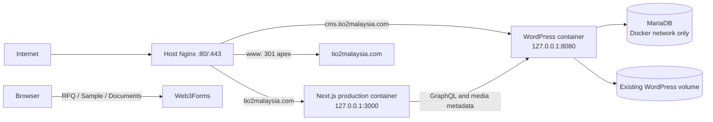

# TiO₂ Malaysia Oracle VPS Production Deployment Design

> **2026-09-11 current decision:** The approved first phase now preserves the existing WordPress service, container MariaDB and data volumes while installing the fixed program and adding frontend slots. The [production adoption design](2026-09-11-tio2-production-adoption-design.md) supersedes this document's first-takeover, controlled-Compose ownership and data-migration sequence for that phase. The broader migration design below remains historical target context and is not authority to migrate production data.

## 1. Purpose and decision status

This document defines the approved target design for deploying the `tio2-my` WordPress backend, approved production data and Next.js frontend to the Oracle VPS at `129.146.68.82`. The public website uses `tio2malaysia.com`; `www.tio2malaysia.com` redirects to the apex domain; the CMS remains at `cms.tio2malaysia.com`.

The design covers the production privilege boundary, packaging, backup, WordPress takeover, data migration, frontend build, traffic switch, verification and rollback. It does not claim that the target state has already been implemented or deployed. The current release source must be an exact, clean and approved `main` commit that has completed the D16 prerelease process. On 2026-09-10 the observed candidate was `9571dd2ab7e7f2c7c9cb373e008ca81b3c534822`; the deployment receipt must record the commit actually released rather than assuming this observation remains current.

This is the first production implementation for `tio2-my`. It does not define a universal topology for every D16 website and does not alter the approved business behavior of the website.

The current system boundary remains documented in [the software architecture](../../software-architecture.md), the release lifecycle and authorization boundary in [the development workflow](../../development-workflow.md), and the local candidate procedure in [the prerelease environment guide](../../prerelease-environment.md). This specification defines the approved production target that those current-state documents may reference only after the corresponding parts are implemented and verified.

## 2. Confirmed starting state

The server inspection established the following starting facts:

- Ubuntu 24.04.4 LTS on ARM64, one CPU, about 5.8 GiB memory, no swap, and about 42 GiB free disk space.
- Nginx accepts public HTTP and HTTPS traffic. Docker and host MariaDB are installed. Public TCP 111 is also present through `rpcbind` and must be investigated before it is left enabled.
- The existing CMS is available at `https://cms.tio2malaysia.com` through Nginx to `127.0.0.1:8080`.
- Existing containers are `wordpress-wordpress-1` using `wordpress:php8.3-apache` and `wordpress-db-1` using `mariadb:11.4`.
- Existing persistent volumes are `wordpress_wp_data` for `/var/www/html` and `wordpress_db_data` for `/var/lib/mysql`. The project plugin is currently mounted from the old repository directory.
- The existing Compose working directory is `/opt/tio2-cms/tio2-wordpress-nextjs/wordpress`. The checked-out repository is root-owned and behind the local release candidate, so production must not depend on `git pull` from that directory.
- WordPress 7.1 and the required GraphQL, ACF, Yoast and `tio2-site-model` plugins are active. The existing public content is sparse and must be preserved and identified before migration.
- The CMS certificate is managed by Certbot. The apex domain currently has no A record and `www` is not configured; `cms` resolves to the VPS.
- The `deploy` account accepts the dedicated SSH key and currently has no Docker access or unrestricted `sudo`. Root remains available for the one-time bootstrap.

These are inspection facts, not a license to erase the old stack. The first release treats the existing database and WordPress volume as production data until a verified backup and migration receipt prove otherwise.

## 3. Target runtime architecture



The host Nginx is the only public application entry point. WordPress and Next.js bind explicitly to loopback. MariaDB has no host port. Docker control remains available only to root and the fixed deployment program.

The controlled production Compose project lives below `/opt/tio2-production/compose/`. It takes ownership of the existing `wordpress_wp_data` and `wordpress_db_data` volumes as explicitly declared external volumes. The old Compose project is stopped during the first controlled takeover and is not deleted until the release is verified. It must never run concurrently against the same writable volumes.

The Next.js service is added as a production container. It runs an immutable image built for the exact release commit. Releases validate a candidate image on fixed loopback-only port `127.0.0.1:3001` before replacing the active container on `127.0.0.1:3000`; Nginx always serves the active production endpoint on port 3000. Port 3001 is closed again after a successful switch or failed attempt.

## 4. Privilege and filesystem boundary

### 4.1 Operator account

Automation connects through the existing `deploy` account using the dedicated key. The account remains outside the `docker` group and receives no general root shell. Password SSH and root SSH are disabled only after the fixed program, key login and Oracle console recovery have been tested.

The SSH key is limited with `authorized_keys` options that disable agent forwarding, port forwarding and X11 forwarding. The local private key is protected by Windows filesystem permissions and is never copied into the repository or release package.

### 4.2 Fixed privileged program

The only root escalation granted to `deploy` is:

```text
sudo /usr/local/sbin/tio2-release <fixed-action>
```

`/usr/local/sbin/tio2-release` and its supporting modules are root-owned and not writable by `deploy`. The sudo rule permits only this entry point. The program accepts a closed action set:

- `status`
- `prepare`
- `backup`
- `deploy`
- `verify`
- `rollback`

Actions use a state file produced by the preceding action and fixed server paths. They do not accept arbitrary shell fragments, filesystem paths, Compose files, container names or Docker arguments. The program clears inherited environment values, constructs subprocess arguments as arrays, applies timeouts, checks every exit code and never evaluates package text as shell code.

A global file lock allows only one release operation at a time. Every privileged action writes a non-secret audit record containing actor, action, UTC time, release commit, archive hash, prior release, backup identity, result and failure stage.

### 4.3 Fixed directories

```text
/home/deploy/tio2-incoming/          deploy-owned upload landing area
/home/deploy/tio2-outgoing/          deploy-readable encrypted backup export only
/opt/tio2-production/releases/<commit>/
/opt/tio2-production/current         root-owned symlink to active release
/opt/tio2-production/compose/        root-owned fixed Compose definition
/opt/tio2-production/state/          locks, action state and receipts
/opt/tio2-production/backups/<UTC>-<commit>/
/etc/tio2-production/                root-only production configuration
/usr/local/sbin/tio2-release         root-owned privileged entry point
```

The upload landing area has a single expected archive and manifest name. `prepare` rejects anything except a 40-character lowercase Git commit, a 64-character SHA-256, the expected site ID and the expected package schema. It rejects absolute archive paths, `..` traversal, device entries, unsafe links, unexpected ownership metadata, excessive file counts or size, missing required files and files not declared by the package manifest. Extraction occurs into a new root-owned release directory and never overlays the active release.

## 5. Local controller and release package

A repository-owned local controller is the operator interface. After the one-time root bootstrap, the agent can package, upload, invoke fixed actions, collect receipts and stop on failures without asking the user to enter routine server commands.

The controller performs these checks before packaging:

1. The selected source is exactly a clean local `main` commit.
2. The commit has a recorded healthy prerelease run and the applicable 58-object production surface results: 56 ordinary pages, the Thank You state and the new 404.
3. The release site is exactly `tio2-my`.
4. Required source, production Dockerfile, production Compose template, migration manifest and verification contract are present.
5. No secret, local environment file, runtime evidence directory, Git metadata or untracked file enters the archive.

The package is created from `git archive`, augmented only by generated non-secret release metadata. Its manifest records schema version, site ID, full commit, source archive hash, ordered file hashes, required migration manifest hash and expected release surface. The local controller transfers the exact archive and manifest to the fixed incoming directory, then calls `prepare`.

The package contains no credentials. Production values reside in root-only files below `/etc/tio2-production/`. Logs and receipts list required field names and configuration fingerprints, not values.

The repository may expose a single release command that orchestrates all approved stages, but each server stage remains separately callable and resumable for diagnosis. Automation stops at the first failed gate and never converts a failed or skipped check into success.

## 6. Production configuration and build identity

The production configuration must explicitly bind the runtime to the Malaysia site and production URLs. At minimum it defines:

- `SITE_ID=tio2-my`
- `NODE_ENV=production`
- `VERCEL_ENV=production`, because the current application uses this variable as a production identity even outside Vercel
- `NEXT_PUBLIC_SITE_URL=https://tio2malaysia.com`
- the internal WordPress GraphQL endpoint used by the builder and runtime
- the public WordPress/media origin `https://cms.tio2malaysia.com`
- matching WordPress preview and revalidation URLs and secrets
- the editorial API token where required
- the shared approved public Web3Forms key used by RFQ, Sample and Documents
- page-level indexing release flags, enabled only where separately approved

The implementation must derive the exact variable names from current code and fail closed on missing, placeholder or cross-site values. Public client configuration is expected to appear in the browser bundle where the application contract requires it; private credentials, receiver identity and server secrets must not.

The frontend image is built on the production host from the prepared immutable release and the fixed Dockerfile. This produces an ARM64-compatible image using the production CMS and production build configuration. The image is tagged by full commit and recorded by image digest and Next Build ID. A build from local prerelease is evidence for candidate quality, but is not reused blindly when production configuration changes build output.

## 7. Backup contract

`backup` is mandatory after successful preparation and before any writable production change. It first blocks new WordPress mutations, drains in-flight requests, takes the transactional database dump, stops WordPress before archiving its filesystem volume, and then either continues directly into the controlled takeover or restarts the old service if deployment does not proceed. A backup is accepted only when all required parts pass validation:

- A transactionally consistent MariaDB SQL dump, compressed and checked as nonempty, decompressible, structurally recognizable and SHA-256 bound.
- A WordPress data archive covering the existing `wp_data` volume, with readable archive listing, entry count, size and SHA-256.
- The current project plugin, old Compose files and old repository commit/archive identity.
- Active Nginx site configuration plus a successful `nginx -t` result.
- Root-only production configuration in a restricted backup archive; receipts expose only field names and fingerprints.
- A release-state record containing active containers, image digests, WordPress/core/plugin versions, database identity and current release pointer.

The backup is stored at `/opt/tio2-production/backups/<UTC>-<commit>/` with a machine-readable manifest. The release cannot proceed if any backup component or validation fails.

The server retains the latest three complete backups once a newer backup and the current release have both been verified. A root-owned export step encrypts the selected registered backup to a fixed local backup public key and places only the encrypted artifact in `/home/deploy/tio2-outgoing/`; the local controller downloads it, verifies the ciphertext hash and removes the server-side outgoing copy. The deployment account cannot browse or read plaintext root backups.

## 8. WordPress takeover and data migration

The first release preserves the existing database and WordPress volumes. The controlled process is:

1. Inspect and record current WordPress core, plugins, content counts, URLs, users, uploads and Compose volume identities.
2. Complete and verify the mandatory backup.
3. Put CMS mutation behind a short maintenance boundary, stop the old WordPress/DB Compose stack and confirm no container still writes the volumes.
4. Start the fixed production MariaDB and WordPress services against the same external volumes, using pinned images and root-only configuration.
5. Mount the project `tio2-site-model` plugin read-only from the prepared release and verify WordPress/core/plugin compatibility.
6. Run the production migration runner in plan mode, record its normalized plan and hash, then apply exactly that plan transactionally.
7. Read back site scope, record identities, routes, statuses, hashes, GraphQL output, media references and expected counts before building the frontend.

The existing prerelease bootstrap is not run in production because it changes local administrator credentials and local URLs. Production uses a separate allowlisted migration manifest. Implementation must audit every existing seed script before inclusion. Scripts with prerelease-specific naming or behavior, including public-path scripts, may be reused only after their effects are proven production-safe and represented in the production manifest.

Production data changes are incremental and constrained to `site_scope=tio2-my`. The runner may create or update records whose approved identity and prior state are proven. It must reject unknown ownership, another site scope, unapproved deletion, duplicate ambiguity, unexpected current hashes or a mismatch between plan and apply. It does not replace the whole database.

The release surface of 58 objects is a verification contract and must not be confused with a promise that the database contains exactly 58 WordPress posts. CMS expectations are recorded by content type and stable identity in the migration manifest.

## 9. Deployment and traffic switch

After data readback succeeds, the fixed program builds the production Next.js image against the controlled CMS. It starts the image on `127.0.0.1:3001` and verifies site identity, Build ID, CMS identity and representative routes. The candidate has no public traffic and ordinary verification blocks external form submission.

The traffic sequence is:

1. Render new Nginx configuration into a root-owned staging file.
2. Verify the CMS at `127.0.0.1:8080` and the candidate frontend on its fixed loopback endpoint.
3. Run `nginx -t`; a failure leaves the active configuration untouched.
4. Replace the active Next container on `127.0.0.1:3000` with the already verified image and repeat its health/identity checks.
5. Atomically install the Nginx configuration and reload Nginx.
6. Verify host-header routing locally before DNS changes.
7. Point the apex and `www` DNS records to `129.146.68.82`, keeping `cms` on the same address; record authoritative DNS results.
8. Obtain or extend the certificate for apex and `www`, enforce HTTP-to-HTTPS and `www`-to-apex redirects, then run public HTTPS checks.

The apex is canonical. `www` returns a permanent redirect to the equivalent apex URL. CMS traffic continues on its own hostname. DNS and certificate failures do not justify claiming a public launch even if loopback checks pass.

## 10. Failure handling and rollback

The program records the stage and leaves enough state for a deterministic retry or rollback.

| Failure point | Required behavior |
|---|---|
| Package or manifest validation | Make no production change |
| Backup creation or validation | Stop before any writable change |
| WordPress takeover, plugin activation or first-launch migration before public traffic | Stop services as needed and restore the pre-release database/WordPress state automatically from the verified backup |
| Frontend build or candidate health | Keep the existing active frontend and Nginx configuration where one exists; on the first launch leave the public frontend unavailable rather than exposing the failed candidate |
| Active frontend replacement | Restart the prior recorded image on port 3000 |
| Nginx syntax check | Do not install or reload the candidate configuration |
| DNS or certificate | Keep the internally healthy stack, report public launch incomplete and preserve the prior public routing where possible |
| Post-launch code defect | Switch the release pointer, plugin mount and frontend image back to the recorded previous release, then verify |
| Post-launch data defect | Stop affected writes and present the exact restore point and data-loss interval; database restore requires an explicit timepoint decision |

Automatic database restore is permitted during the first launch only while the process still proves that public production writes could not have occurred after the backup. After public traffic or editor access begins, a database restore is never automatic because it could discard new content or operational data. Code rollback and data rollback therefore remain separate actions.

`rollback` without arguments targets only the immediately previous verified release recorded in root-owned state. It cannot select an arbitrary directory, image or backup. Each rollback creates its own receipt and post-rollback verification result.

## 11. Verification contract

### 11.1 Server and isolation

- Required containers are healthy and restart policies work.
- The recorded commit, archive hash, image digests and Next Build ID agree with the active release.
- Public listeners are limited to the intended SSH, HTTP and HTTPS services; WordPress 8080 and Next.js 3000 are loopback-only and MariaDB is internal-only.
- Before backup/build, free disk is at least the greater of 8 GiB or twice the measured source-data-plus-package working set, and available memory is at least 2 GiB. Falling below either threshold stops the release; backup and image retention must not exhaust the 48 GiB disk.
- The deploy account cannot access Docker, plaintext backups, root configuration or arbitrary sudo commands.

### 11.2 CMS and integration

- WordPress admin, GraphQL and required plugins work with the production identity.
- Production migration readback proves `site_scope=tio2-my`, expected content-type identities, statuses, approved hashes and media references.
- The complete release surface resolves to the intended CMS/code sources without cross-site fallback.
- Preview and revalidation use matching secrets and URLs, and a controlled content change proves the CMS-to-Next refresh path where applicable.

### 11.3 Frontend and SEO

- The 56 ordinary pages, Thank You behavior and new 404 are tested on the exact public release.
- Desktop and mobile viewports cover navigation, images, forms, canonical URLs, redirects, robots, sitemap and material visual states.
- There is no mixed content, cross-site identity, blocker console error or unexpected broken link.
- Production identity is explicit. Page-level release flags remain authoritative: only pages with approved indexing are indexable after online validation.
- `www` redirects to the apex and canonical metadata uses the apex domain.

### 11.4 Business submissions

Ordinary production verification performs zero external POSTs. RFQ, Sample and Documents availability, validation and payload construction are checked without sending. A real production submission is a separately tracked action that records browser result, provider acknowledgement and actual inbox receipt as distinct facts. All three forms use the same approved production Web3Forms key, but a shared key does not by itself prove receiver or mailbox behavior.

No release is marked complete from container health alone. The final receipt distinguishes server health, CMS/data verification, frontend/E2E verification, public DNS/TLS, indexing state, provider acknowledgement and mailbox receipt.

## 12. Security completion

After a successful deployment and rollback rehearsal:

- Disable SSH password authentication and direct root SSH login; retain Oracle console recovery.
- Allow key-based access for the deployment account and apply the restricted key options.
- Confirm the sudo policy exposes only the root-owned fixed program.
- Confirm Nginx, Docker, MariaDB, WordPress and Next listeners against the intended network boundary.
- Determine whether `rpcbind`/TCP 111 is required. If unused, disable the service and remove public access; if required, document and firewall its exact consumers.
- Keep secrets in root-only configuration, redact command output and rotate any credential found in logs or shell history.
- Record privileged release actions in the system journal and immutable release receipts.

SSH hardening occurs after key access, the deployment program and console recovery have all been verified so the server is not locked out.

## 13. State model and receipts

The deployment state is one of:

- `IDLE`
- `PREPARED`
- `BACKED_UP`
- `DEPLOYING`
- `INTERNAL_VERIFIED`
- `PUBLIC_VERIFIED`
- `FAILED`
- `ROLLING_BACK`
- `ROLLED_BACK`

Transitions are monotonic for one release attempt and bound to a full commit and archive hash. A new package starts a new attempt; it cannot inherit a prior backup or verification result unless the manifest proves the exact same immutable input and the program explicitly records that reuse.

The final receipt includes site, environment, commit, archive and manifest hashes, image digests, Build ID, CMS/migration identity, backup ID, DNS/TLS results, verification results, indexing state, deployment and verification times, previous release, rollback target and unresolved items. It contains no secret values or personal form data.

## 14. Implementation stages and acceptance criteria

Implementation is divided into reviewable stages:

1. Repository production contracts, local controller and tests.
2. Root-owned server program, fixed Compose/Nginx templates and one-time bootstrap package.
3. Dry-run package validation and privilege-boundary tests on the server.
4. Verified backup and encrypted offsite export.
5. Controlled WordPress takeover and production migration plan/readback.
6. Production frontend build, internal validation and rollback rehearsal.
7. Nginx, DNS and TLS switch.
8. Public 58-object validation, release receipt and security completion.

The design is implemented only when all of these conditions are demonstrated:

1. A clean approved `main` commit produces a deterministic package whose manifest and every file hash are verified on the server.
2. `deploy` cannot invoke arbitrary root commands, Docker arguments or paths, and cannot modify the privileged program or production configuration.
3. A validated database, WordPress, code, Nginx and configuration backup exists locally on the server and as an encrypted offsite copy before mutation.
4. Existing WordPress data and uploads survive takeover; production migrations affect only proven `tio2-my` records and produce plan/apply/readback evidence.
5. The production frontend image is bound to the recorded commit, image digest, Build ID, production configuration fingerprint and CMS identity.
6. Only Nginx is publicly exposed for the application; database, WordPress and Next.js listeners match the approved boundaries.
7. Failed package, backup, migration, build, health or Nginx checks stop at the defined boundary and the rollback path is rehearsed.
8. The public site passes the applicable 58-object, responsive, CMS/media, SEO, redirect, 404 and Thank You checks on the exact deployed release.
9. Ordinary verification sends no external forms; any real production submission is separately authorized and reported across browser, provider and inbox layers.
10. Receipts allow an independent operator to identify the active release, previous release, backup, results and unresolved items without exposing credentials.

## 15. Deferred scope

This first implementation does not introduce Git-hosted CI runners, automatic deployment on push, multi-node orchestration, a managed database, zero-downtime database migration, general-purpose server administration or a deployment topology for other D16 sites. The fixed program provides deterministic production delivery after an approved release trigger; future CI/CD automation may call the same package and verification contracts without widening server privileges.

Application monitoring beyond release-time health checks, centralized log aggregation, alerting and disaster-recovery infrastructure are separate operational improvements. Their absence must be recorded in the release handover and cannot be hidden by a successful first deployment.
