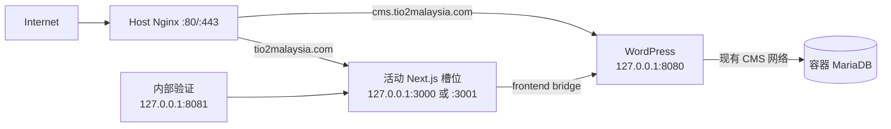

# TiO₂ Malaysia 生产环境首次接管设计

日期：2026-09-11。状态：设计已由用户逐节确认；尚未实现、安装或执行。本规格只定义 `tio2-my` 在 Oracle VPS `129.146.68.82` 的首次接管与首次开放，不授权服务器写入、DNS 修改或生产发布。

## 1. 目标与适用关系

第一阶段保留现有 WordPress、容器 MariaDB、两个数据卷和 CMS 服务，安装固定部署程序并增加 Next.js 前台双槽位。第一阶段不迁移 CMS、数据库或业务内容；生产内容若与批准的预发布内容不一致，正式开放必须停住，另行设计数据迁移。

本规格补充并修正[原生产部署设计](2026-09-10-oracle-vps-production-deployment-design.md)的首次接管部分。原设计中“停止旧 Compose、由新 Compose 接管数据卷并迁移内容”的方案不用于当前第一阶段。日常固定发布协议仍以[生产部署说明](../../production-deployment.md)及其实际实现为准；只有本规格要求的接管能力实现并验证后，才可以在生产服务器采用。

## 2. 已核实的起点

- 服务器为 Ubuntu 24.04、ARM64、1 CPU，约 5.8 GiB 内存、无 Swap，根盘约 42 GiB 可用。
- Nginx、Docker、SSH 正常；公网 80/443 可达。
- `cms.tio2malaysia.com` 已通过 Nginx 代理到 `127.0.0.1:8080`，CMS HTTPS 正常。
- 当前运行 `wordpress:php8.3-apache` 和 `mariadb:11.4` 两个容器，使用 `wordpress_wp_data` 与 `wordpress_db_data` 持久卷。
- 现有仓库和插件绑定位于 `/opt/tio2-cms/tio2-wordpress-nextjs`，由 root 所有；服务器源码落后于本地候选，生产发布不能依赖服务器执行 `git pull`。
- 宿主机还运行另一套 MariaDB。首次 Plan 必须证明它的数据目录、数据库和写入范围与容器数据库隔离。
- `deploy` 账户可使用专用 SSH 密钥登录，但没有 Docker、root 配置、明文备份或通用 sudo 权限。
- `tio2malaysia.com` 与 `www.tio2malaysia.com` 尚无可用前台 DNS/TLS；固定部署程序尚未安装或登记。

以上事实只说明起点，不表示生产内容、备份、ARM64 前台构建或公网网站已经验收。

## 3. 第一阶段边界

第一阶段允许：

- 安装独立于网站包的 root 固定程序和最小 sudo/SSH 调用边界；
- 建立 root 保护的配置、状态、审计、备份和发布目录；
- 登记现有 CMS、容器数据库、镜像、卷、网络和配置的精确身份；
- 创建专用前台 Docker 网络；
- 必要时在保持镜像、卷、端口和数据库连接的条件下受控重建 WordPress 容器，以写入固定回调地址；
- 构建一个批准的 `main` 前台镜像，启动活动槽位并预留另一槽位；
- 增加 Nginx 内部验证入口和后续公网前台配置。

第一阶段禁止迁移、替换、清空或重新 seed WordPress/数据库；禁止运行仓库中的完整生产 Compose 接管现有 CMS/数据库；禁止自动停止与网站隔离的宿主机 MariaDB；禁止网站包替换 root 程序或系统配置；禁止在内容指纹、三道验证门或 DNS/TLS 条件不满足时开放前台。

## 4. 权限与一次性接管程序

管理员包与网站发布包分离。管理员包由本地锁定版本生成 SHA-256 清单。root 先在临时 staging 中核对完整字节，再直接运行包内只读 Plan；此时不持久安装固定程序。只有匹配计划哈希的第一次 Apply 才安装固定目录、日常程序和最小调用策略。日常 `deploy` 账户仍只能调用 `status prepare backup deploy verify rollback` 六个固定动作，不能调用首次接管程序。

一次性接管程序只有两个操作：

- `plan`：全程只读，输出当前拓扑、内容与配置指纹、拟进行的固定变化、回退步骤和计划哈希。
- `apply PLAN_SHA256`：只接受 Plan 生成的完整哈希；它可恢复执行，但不能接收路径、命令、镜像、容器、网络或挂载等自由参数。

Apply 每次开始都重新核对 Plan 中的容器、镜像、卷、网络、配置和文件身份。任何漂移使旧计划失效，必须重新 Plan 和审查。安装、Plan 或日常状态检查都不能自动登记生产基线。

## 5. 生产运行拓扑

| 用途 | 地址 |
|---|---|
| CMS | `127.0.0.1:8080` |
| 前台槽位 A | `127.0.0.1:3000` |
| 前台槽位 B | `127.0.0.1:3001` |
| Nginx 内部活动版本验证 | `127.0.0.1:8081` |

专用 `frontend` bridge 只连接 WordPress 与前台容器；容器数据库不加入该网络。WordPress 通过唯一网络别名 `web:3000` 调用当前活动前台。两个前台容器只能有一个持有 `web` 别名。

Nginx 使用 root 保护的 `/etc/tio2-production/web-upstream.conf` 指向活动槽位。槽位端口都只绑定 loopback；Nginx 是前台唯一公网入口。现有 CMS server block、证书和8080代理保持原职责。

当前代码已经要求独立 `proxyPort`，但现有 Nginx 模板没有 `127.0.0.1:8081` listener。实施时必须补齐并进行真实 Nginx 语法、重载和活动版本响应头测试。

## 6. WordPress 接入规则

Plan 读取实际 WordPress 容器环境。如果 Malaysia 回调已经精确指向 `http://web:3000/api/revalidate` 和 `http://web:3000/api/preview`，Apply 只需把 WordPress 连接到前台网络。

若不一致，Apply 才允许受控重建 WordPress 容器。重建必须保留已登记镜像、数据库环境、`wordpress_wp_data`、插件只读绑定和 `127.0.0.1:8080`，并保证同一 WordPress 卷在任一时刻只有一个可写容器。

失败时删除新容器并恢复原容器及其网络。CMS 短暂中断时间、旧/新容器身份和恢复结果写入接管回执。任何无法完整捕获或重放的容器配置都阻止 Apply。

## 7. 两阶段 Apply 与恢复证明

同一个 `apply PLAN_SHA256` 可按持久阶段重复调用并从 root 日志恢复，但始终绑定同一计划。正常首次接管调用三次：备份、内部接入、DNS生效后的TLS开放；中断重试仍复用同一命令和计划哈希。

### 7.1 第一次调用：建立恢复能力

1. 安装固定目录、程序和最小调用策略。
2. 生成并验证现有 CMS/数据库的临时备份基线。
3. 暂停新的 WordPress 写入并排空已有请求。
4. 备份数据库、完整 WordPress 文件卷、插件和 root 配置指纹。
5. 在隔离容器中恢复数据库和 WordPress 文件并逐项比对。
6. 恢复原 WordPress 写入。
7. 生成加密备份并停在 `AWAITING_OFFHOST_VERIFICATION`。

本地控制器下载加密备份，核对 ciphertext SHA-256，真实解密，并在独立本地 Linux/Docker 环境完成数据库、WordPress 文件、文章计数和 UID 33 插件加载验证。只有这些证据完整后才生成与 Plan、备份和恢复结果绑定的接管证据。

### 7.2 第二次调用：接入前台并等待DNS

1. 重新核对 Plan、现有拓扑和服务身份。
2. 核对服务器备份、本地下载、解密和独立恢复证据。
3. 建立前台网络并按第6节处理 WordPress 回调。
4. 原生构建批准的 ARM64 前台镜像。
5. 在一个槽位启动前台，完成候选与内部代理验证。
6. 安装并验证 Nginx 内部入口，以及只开放 ACME challenge、其他前台请求返回503的HTTP引导配置。
7. 写入并独立验证 v3 生产基线。
8. 停在 `AWAITING_DNS`，不签发证书、不开放HTTPS前台。

第一次接管只需要一个活动前台容器；另一固定端口保持空闲，供下一版本作为候选槽位。第一版尚无旧前台，接管失败时的回退结果是“CMS 正常、前台未开放”。

### 7.3 第三次调用：TLS与公网就绪

DNS管理方把 apex 与 `www` 指向固定服务器IP。第三次 Apply 重新核对相同计划、活动基线、DNS解析和HTTP challenge，随后通过固定 Certbot webroot 调用签发证书，核对SAN/证书链/有效期，安装正式Nginx配置并完成语法检查、重载和公网身份探测。成功后进入 `PUBLIC_READY`；完整58对象及浏览器验收仍由Gate C完成。

## 8. 数据与内容门

第一阶段禁止内容迁移，但 Plan 仍必须读取生产 CMS 的非秘密内容清单并生成指纹。至少包括网站身份、插件版本、已发布记录数量、页面/业务对象身份、状态、更新时间和批准内容哈希。

批准的预发布基线包含56条已发布业务记录。生产内容必须与该基线逐项一致，或具有另行批准的差异清单。记录缺失、额外、重复、未发布、跨站、插件/GraphQL不兼容、无批准内容差异，或无法证明两套 MariaDB 隔离，都会阻止正式开放。

确认宿主机 MariaDB 完全独立时，将其登记为不受本程序管理的服务并保持运行。用途不明或触及目标数据时，Apply 在任何接管副作用前失败。

## 9. ARM64 构建与资源规则

前台镜像在生产服务器原生 ARM64 构建，使用固定安装的 Dockerfile、BuildKit secret、受控生产环境和当前生产 CMS。当前阶段不引入 CI 镜像仓库、跨平台远端构建或 Swap。

- 全局锁保证一次只有一个备份、构建、部署或回滚。
- 构建前要求至少 4 GiB 可用内存和 12 GiB 可用磁盘；不足时直接失败。
- 构建最长一小时，使用较低进程和磁盘优先级；构建期间持续验证 CMS 可用性。
- 编辑令牌只通过 BuildKit secret 传入；`.next/cache` 使用 tmpfs。
- 只清理能由计划、发布标签和精确身份证明归属的候选资源。
- 构建失败、超时或 CMS 异常时删除候选，保持 CMS 和现有活动前台。

首次真实构建记录耗时、可用内存、磁盘变化和 CMS 健康。只有实际 OOM 证据出现后，才另行讨论 Swap 或其他构建方式。

## 10. DNS、TLS 与首次开放

1. 前台先在活动槽位和 `127.0.0.1:8081` 完成内部验证。
2. 保持 `cms.tio2malaysia.com` 的配置、证书和代理不变。
3. 将 apex 与 `www` 的 A 记录指向 `129.146.68.82`。
4. 第二次 Apply 启用 HTTP-only 引导配置：ACME challenge 可访问，其他前台请求返回503，然后停在 `AWAITING_DNS`。
5. DNS生效后第三次 Apply 用 Certbot webroot 取得同时覆盖 apex 与 `www` 的证书并核对域名、证书链和有效期。
6. Nginx 语法检查成功后加载正式配置：apex 代理活动槽位，`www` 永久跳转 apex，CMS 继续代理8080。
7. 完成公网生产验证；任何失败都不能生成生产完成回执。

DNS 不作为应用版本回滚工具。首次开放失败时，Nginx 将 apex 恢复为503；后续发布失败时通过前台槽位回切。

## 11. 三道发布门

### Gate A：当前提交重新完成预发布

待发布源码必须是干净、准确、批准的 `main` 提交。当前 `main/develop` 为 `fd2bf3b3343d5f893abe9be906b37388f7e3e7c8`；现有58对象通过证据属于旧提交 `427d232841ac60da6cc7b3e67963fffc57a4ac10`，且该旧提交的 RFQ、Sample、Documents 真实提交均返回 HTTP 400。因此当前证据不能授权打包生产版本。

Gate A 必须重新构建当前候选并完成：56个业务页面、Thank You、新版404，共58个对象；1440、768、390三个视口；公开路径、内部链接、页面身份、布局、键盘和表单行为；三种真实表单服务商接受及实际收件确认。

### Gate B：切流前生产内部验证

生产 CMS 与批准内容指纹一致后，固定程序验证实际容器、镜像、Build ID、站点身份、CMS身份、release-surface 登记的58个对象及其预期HTTP状态、全部内部链接、活动别名和 Nginx `8081` 响应；其中业务清单另标记42条 eligible route，不缩小本次58对象的验证范围。该阶段使用真实生产 CMS 和真实候选，不进行外部表单提交，公众仍访问不到候选。

### Gate C：切流后真实生产 E2E

从本地控制器访问真实 `https://tio2malaysia.com`：

- 56个页面、Thank You、新版404，共58个对象；
- 1440、768、390三个视口，共174个浏览器案例；
- HTTP状态、站点/版本身份、Canonical、robots、Schema、导航、内部链接、图片、Cookie、键盘、可见焦点、横向溢出和404投影；
- 公网 DNS、TLS、CMS 域名隔离、`www` 跳转和活动版本响应头；
- RFQ、Sample、Documents 各一次真实 Web3Forms 提交，使用批准的同一 access key、合成测试数据和唯一请求令牌；每种工作流只允许一次 POST；
- Web3Forms 必须返回 HTTP 200 与 `success=true`，跳转至正确 Thank You，并在已批准的生产收件邮箱按请求令牌逐项确认实际收件。

用户已在本设计讨论中明确授权上述生产域名三次真实提交及收件确认。准确收件地址只保存在忽略的私有 receiver binding 中；跟踪文档和回执保存绑定指纹，不保存地址。回执只保存工作流、页面ID、请求令牌、状态、分类和时间，不保存 access key、邮箱正文或个人表单内容。

## 12. 验证状态与完成含义

当前远端 `verify` 仅验证 `/`、`/about`、`/markets/`，不能代表 Gate B 或 Gate C。实施必须扩展固定路径验证，并使状态名称与真实证据一致：

- `INTERNAL_VERIFIED`：候选和内部 Nginx 代理通过 Gate B。
- `PUBLIC_VERIFIED`：DNS/TLS 与服务器端公开路径检查通过。
- 最终生产完成回执：本地174案例和三种真实表单/收件全部通过，并绑定同一 commit、archive、Build ID、CMS 指纹、活动基线、备份和公网身份。

服务器 `PUBLIC_VERIFIED` 本身不替代本地浏览器E2E或收件确认。最终回执缺少任何一项时，只能报告实际已完成的阶段。

## 13. 错误处理与回滚

| 失败阶段 | 固定结果 |
|---|---|
| Plan 身份、内容或隔离不明 | 无写入，拒绝 Apply |
| 备份或服务器隔离恢复 | 恢复 WordPress 写入，保持原系统 |
| 异地下载、解密或本地恢复 | 保持 `AWAITING_OFFHOST_VERIFICATION`，不接入前台 |
| WordPress 网络/回调接入 | 恢复原容器及网络，CMS 回到已登记状态 |
| 前台构建或候选健康 | 删除候选，保留 CMS 和现有活动前台 |
| Nginx 语法或内部验证 | 不加载新配置；已加载但验证失败时恢复精确旧配置 |
| DNS尚未生效 | 保持HTTP 503和ACME入口，停在 `AWAITING_DNS` |
| Certbot或正式TLS配置 | 保持HTTP 503，恢复精确旧Nginx配置，CMS继续运行，状态回到 `AWAITING_DNS` 供同一计划重试 |
| 首次公网验证 | apex 返回503，CMS继续运行 |
| 后续版本公网验证 | 以绑定当前状态的 rollback intent 回切上一槽位 |
| 上线后的数据问题 | 停止受影响写入并展示恢复点与可能丢失区间；数据库恢复另行决定 |

第一阶段没有数据库、插件或业务内容变化，固定程序不得自动恢复生产数据库。每次代码回滚与数据恢复保持两个独立决定。

## 14. 安全与审计

- root 程序、基线、Nginx include、环境、明文备份和审计只允许 root 读取或写入。
- `deploy` 账户不能访问 Docker socket、明文备份、root 配置或任意 sudo 命令。
- 所有固定操作使用全局锁、原子状态写入、幂等恢复和明确资源身份。
- 网站包不能提供服务器路径、Shell、镜像运行参数或系统配置。
- 日志和回执保存动作、UTC 时间、站点、提交、归档/清单哈希、计划、基线、镜像、Build ID、备份、验证和失败阶段；不保存密码、token、私钥、完整环境值或表单正文。

## 15. 实施前必须关闭的代码差距

1. 新增 root-only、两操作、可恢复的一次性接管程序及 Plan 哈希合同。
2. 生成并验证现有 CMS/数据库临时备份基线，打通两阶段 Apply 与异地恢复证据。
3. 支持在严格身份约束下连接网络或受控重建现有 WordPress 容器。
4. 把完整生产 Compose 从首次接管执行路径移除；保存 root 保护的现状 Compose 快照。
5. 补齐 `127.0.0.1:8081`、HTTP 503/ACME、`AWAITING_DNS`、固定Certbot和正式TLS恢复流程。
6. 扩展 production verify 的路径、DNS、TLS和身份检查，并建立最终本地生产E2E回执。
7. 增加 ARM64 原生构建、资源阈值、超时、CMS 连续健康和归属清理的真实服务器验收。
8. 让安装、重复 Apply、中断恢复、首次失败、后续槽位切换和回滚都具有独立测试与审查证据。

## 16. 完成标准

只有以下各项全部成立，才可以宣布首次生产发布完成：

1. 当前准确 `main` 通过 Gate A，历史提交证据没有被复用为当前通过。
2. root 审查并执行准确 Plan；服务器漂移会使 Plan 失效。
3. 原 CMS、容器数据库和数据卷得到保留，宿主机 MariaDB 隔离已证明。
4. 服务端备份、加密异地副本、真实解密和独立恢复均通过。
5. 生产 CMS 内容与批准预发布基线一致，或所有差异都有批准记录。
6. ARM64 前台构建、活动槽位、回调别名和内部 Nginx 通过 Gate B。
7. apex/`www` DNS、TLS、跳转和 CMS 隔离正确。
8. Gate C 的174个浏览器案例全部通过。
9. 三种生产 Web3Forms 工作流均获服务商接受并实际收件。
10. 最终回执绑定完整版本、数据、运行时、备份和验证身份，且没有把未测试项写成通过。
