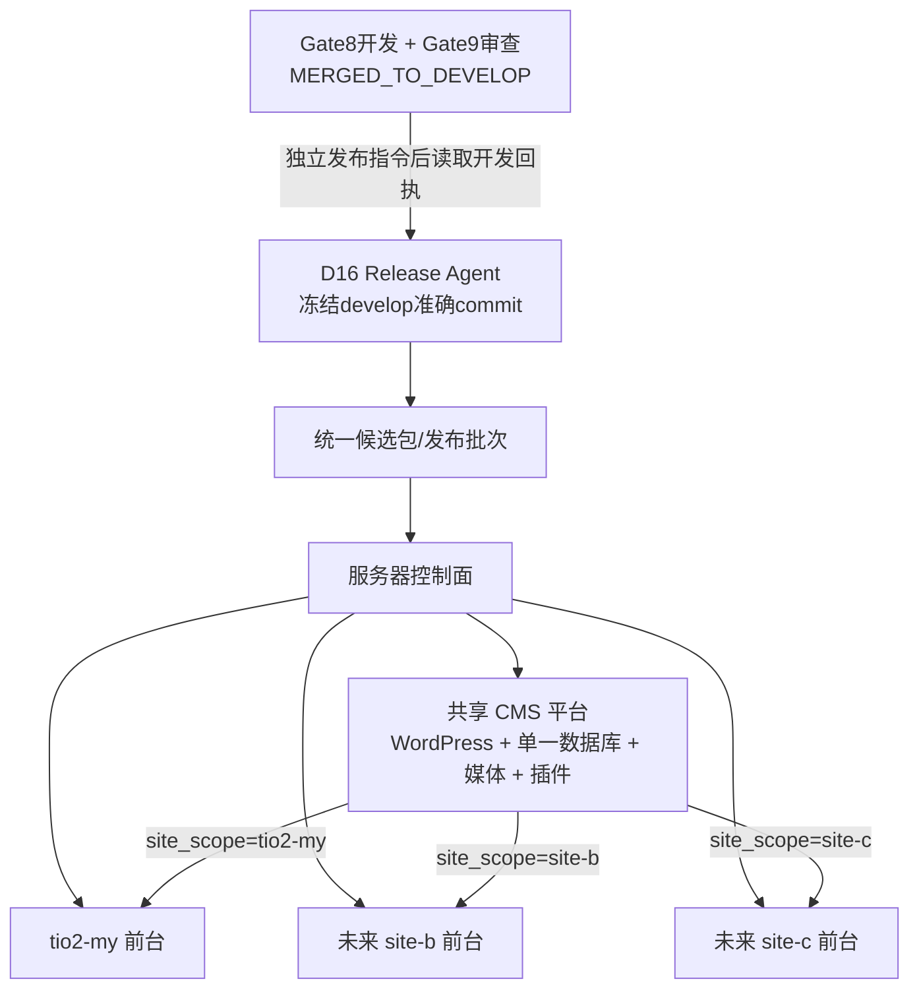

# D16 五类发布系统与共享 CMS 架构设计

> 后续决定：第二阶段内容发布改按[最小内容发布改造](2026-09-12-minimal-content-release-design.md)执行。用户接受暂停共享 CMS 写入、整库备份和发布窗口内失败整库恢复；本文件中的 generation、网站范围备份及独立历史内容回退不再作为第二阶段前提。阶段一实现和历史回执按原范围保留。

**状态：** 开发/发布边界、五类发布、统一控制器、权限、状态、包、回退及测试模型已于 2026-09-12 逐项获得用户确认

**适用范围：** D16 管理、部署和发布的多个网站及其共享 CMS

**共享 CMS 模型：** 一套 WordPress、一个数据库，通过 `site_scope` 隔离各网站内容

**首个前台：** `tio2-my`，公开域名为 `tio2malaysia.com` 与 `www.tio2malaysia.com`

**共享 CMS 入口：** `cms.tio2malaysia.com`

**现有生产候选：** `8bf2a3d437b0582ef0ce193b69478622e26419af`

## 1. 背景与问题

当前 TiO₂ Malaysia 固定发布程序是单网站实现。站点身份、域名、目录、容器、端口、证书、Nginx 文件和状态目录均写死为 `tio2-my`。首次接管时，生产基线登记了新前台的 Nginx 配置和主域证书，但保留中的 CMS Nginx 配置及 CMS TLS 依赖没有进入日常备份基线。当前候选已进入服务器 `PREPARED`，固定备份因此在写入停止前失败；公众仍使用旧版本，没有发生切流。

长期目标不是为每个网站部署一套 WordPress。所有网站共用一套 WordPress 和一个数据库，通过 `site_scope` 读取、编辑、缓存和失效各自内容。因此 `cms.tio2malaysia.com` 是 D16 的共享 CMS 平台入口，不属于 `tio2-my` 前台的独占运行时。未来新增的独立网站只新增前台发布单元和 CMS 内容作用域。

如果继续把共享 CMS 当作 `tio2-my` 的一部分，会造成以下问题：

- 发布 `tio2-my` 时会停止或备份所有网站共用的 CMS；
- `tio2-my` 的回退会错误获得修改共享 CMS 的权限；
- 新增网站后，CMS 数据、插件和证书的责任无法表达；
- 某个前台发布可能把共享数据库和其他网站内容装入自己的备份；
- CMS 插件或数据结构变化无法触发所有网站的兼容性回归；
- 证书正常续期会被误判为永久基线篡改。

本设计把生产系统拆成“服务器控制面、共享 CMS 平台、多个独立前台网站”。

## 2. 目标与非目标

### 2.1 目标

1. 一个固定发布控制器承接服务器、共享 CMS 和多个 root 已登记的前台网站。
2. 所有网站使用同一套 WordPress 和一个数据库，并按 `site_scope` 失败关闭地隔离内容。
3. 每个网站独立交付前台代码、所属 `site_scope` 的内容数据，或两者的组合包。
4. 本地完成开发和预发布后只上传一次声明式网站包，由服务器完成校验、暂存、备份、激活、验证和回退。
5. CMS 核心、共享插件、数据结构和跨作用域迁移作为共享平台独立发布，并验证所有网站消费者。
6. Nginx 公共配置、共享 CMS 配置和前台网站专属配置具有明确归属。
7. 网站交付不能读取、导出、停止或修改其他 `site_scope` 和其他网站的私有资源。
8. 未登记的 Nginx 配置、域名、端口、容器或文件继续失败关闭。
9. deploy 用户只调用固定主体和固定动作；路径、命令和运行时身份由 root 配置决定。
10. 将现有生产系统在不移动数据、不修改 Nginx 内容、不重载和不切流的情况下迁入新架构。
11. 先用预发布 seed 身份、首次接管导入回执和发布前生产作用域读回组成的证据链，判定当前候选是否是 `frontend-only`；证据连续且生产内容未变化时保留当前 `PREPARED` 和同一个 RunRoot，任一环不一致时不得改写不可变包，须封存为 superseded 并重新生成 `combined` 网站包。
12. 开发以合入 `develop` 和开发回执为终点；发布由独立指令触发，从冻结准确 `develop` commit 开始，负责发布侧集成、`main`、预发布和生产验收。
13. 五种正式发布类型使用同一公共包信封、严格类型载荷和统一控制器；跨主体上线使用有序 Release Campaign，不使用拥有全部权限的大包。

### 2.2 非目标

- 本轮不为每个网站创建独立 WordPress、数据库或 CMS 域名。
- 本轮不把多个前台网站合并为一个 Next.js 应用。
- 本轮不实现多个发布同时切流；第一版使用服务器全局发布锁串行执行。
- 本轮不迁移现有 WordPress 数据卷、数据库或活动发布目录的物理位置。
- 本轮不改变业务内容、域名、DNS、表单收件配置或网站视觉。
- 本轮不引入 CI/CD；它仍按已约定在本次生产发布完成后单独设计。
- 合入 `develop` 不自动启动发布；发布必须由用户或发布主控以独立指令发起。
- Gate8、Gate9 不负责 `main`、预发布或生产发布，也不由发布Agent修改业务代码。

## 3. 架构与发布主体



### 3.1 服务器控制面

服务器控制面拥有公共 Nginx 配置、公共 TLS 参数、端口登记、全局锁、主体登记、sudo 规则和固定发布程序版本。公共资源变化必须经过 root 级服务器升级。

### 3.2 共享 CMS 平台

共享 CMS 是独立发布主体 `cms`，拥有：

- WordPress 容器和唯一数据库容器；
- WordPress 文件、媒体卷和数据库卷；
- CMS Nginx Server Block 与 CMS 证书身份；
- GraphQL、预览、重验证和共享插件；
- 内容模型、`site_scope` 约束和编辑权限；
- 独立活动版本、备份、发布状态和恢复回执。

CMS 平台发布影响所有已登记网站。WordPress 核心、共享插件、GraphQL contract、内容结构、作用域规则、跨作用域 seed 或全局数据迁移中的任何变化，都必须走 CMS 平台发布，先完整备份共享 CMS，再回归所有网站。只写入一个既有 `site_scope`、且不改变结构的声明式内容包属于网站交付。

### 3.3 前台网站发布单元

每个前台网站由唯一 `siteId` 标识，拥有：

- 公开域名及别名；
- Next.js 代码、镜像、活动槽位和候选槽位；
- 专属 Nginx Server Block、upstream 与公开证书身份；
- 独立候选、活动版本、内容 generation、备份、状态和回退记录；
- 对共享 CMS 的接口版本依赖和本网站内容指纹。

网站交付可以只包含前台、只包含该网站内容，或同时包含两者。内容只能以受限声明式记录写入准确 `site_scope` 的新 generation；上传包不能携带或执行 SQL、PHP、WP-CLI、shell 或任意迁移代码。改变 WordPress、插件、Schema 或跨作用域数据时，必须升级为 CMS 平台发布。

### 3.4 内容作用域

共享数据库中的站点内容必须绑定 `site_scope`。当前使用 `tio2-my`，未来使用相应网站 ID。所有读取、编辑、预览、缓存、重验证、SEO 投影、导航、媒体关系和表单上下文都必须携带准确站点身份；缺失、未知或跨站作用域失败关闭。

每个 `site_scope` 另有一个活动内容 generation。网站内容包先导入新的不可见 generation，旧前台继续读取旧 generation；候选前台通过受控预览身份读取新 generation。验证通过后，发布日志协调更新活动内容 generation 和前台 upstream；任一步失败都恢复旧 generation 指针和旧 upstream。旧 generation 按回退保留策略保存，不在切流事务中立即删除。

### 3.5 开发与发布责任边界

Gate8负责开发、任务内分层测试、返修和技术交回；Gate9负责独立审查。Gate9通过后通知Gate8，由Gate8把准确实现合入 `develop` 并写开发回执。开发回执记录任务、网站或共享模块、合并commit、实际改动、已运行测试、受影响消费者、预计发布影响和未决项，但不包含生产命令、备份、授权或切流。

开发到 `MERGED_TO_DEVELOP` 结束。合入 `develop` 不触发发布。发布Agent收到独立发布指令后冻结当时准确的 `develop` commit，在隔离worktree中收集 `main..candidate` 涵盖的开发回执并核对Git差异。新的开发可以继续合入 `develop`，但不会进入已冻结候选。发布测试发现业务或代码缺陷时退回Gate8重新开发、经Gate9复审并合入 `develop`；发布Agent不直接修改业务实现。

发布Agent负责发布侧集成E2E、把通过的准确候选合入 `main`、建立 `main`预发布、完成预发布验收、生成不可变候选包、规划五类生产发布、执行生产三道门和封存最终回执。`main`表示当前预发布候选；生产版本只由最近一次 `PRODUCTION_VERIFIED` 回执确定。预发布失败时停止生产并保留失败候选和回执，不重写 `main` 历史；修复进入新的冻结候选。

### 3.6 统一发布控制器

服务器只安装一个统一控制器，由六个内部部分组成：主体登记解析器、公共包校验器、五类发布适配器、主体状态仓库、服务器全局事务锁、审计与回执写入器。控制器先从root维护的登记中解析资源，再校验不可变包和当前生产基线，最后按包内声明选择唯一适配器；适配器不能越过主体或发布类型访问其他资源。

主体状态相互独立，全局锁只负责让第一版发布事务串行执行。所有状态变化、备份、激活、恢复和人工确认均写入持久日志；命令输出、SSH会话状态或单个进程退出本身不构成最终发布事实。

## 4. 目录与登记

### 4.1 标准目录

```text
/etc/d16-release/
  host.json
  host-baseline.json
  cms/
    subject.json
    baseline.json
    production.env
  sites/
    <siteId>/
      site.json
      baseline.json
      production.env
      upstream.conf

/opt/d16-release/
  program -> programs/generation-*/
  programs/
  state/
    release.lock
  cms/
    backups/
    state/
  sites/
    <siteId>/
      current
      releases/
      backups/
      state/

/home/deploy/d16-incoming/cms/
/home/deploy/d16-outgoing/cms/
/home/deploy/d16-incoming/<siteId>/
/home/deploy/d16-outgoing/<siteId>/
```

前台 `siteId` 必须匹配 `[a-z0-9][a-z0-9-]{0,62}`。保留主体 `cms` 只表示共享 CMS。所有主体必须精确存在于 root 所有、不可组写或全局写的登记中；调用者不能提供路径。

### 4.2 `tio2-my` 兼容迁移

为避免在正在进行的发布中移动活动文件，首轮迁移允许 root 登记继续指向现有路径：

```text
/etc/tio2-production
/opt/tio2-production
/home/deploy/tio2-incoming
/home/deploy/tio2-outgoing
```

现有 WordPress、MariaDB 和持久卷登记为共享 CMS 资源；现有 Next.js 活动版本、前台配置和候选登记为 `tio2-my` 资源。这些兼容路径由迁移程序固定映射，不通过 deploy 参数选择。未来前台直接使用标准目录。

## 5. 固定命令与权限边界

统一入口为：

```text
/usr/local/sbin/d16-release <subject> <action>
```

其中 `<subject>` 是 `host`、`cms` 或已登记的前台 `siteId`，动作保持关闭集合：

```text
status prepare backup stage activate verify rollback
```

sudoers 为每个主体逐项生成准确命令，例如：

```text
deploy ALL=(root) NOPASSWD: /usr/local/sbin/d16-release tio2-my status
deploy ALL=(root) NOPASSWD: /usr/local/sbin/d16-release tio2-my prepare
deploy ALL=(root) NOPASSWD: /usr/local/sbin/d16-release cms status
```

deploy用户可以执行已批准的网站与CMS固定动作；`host`基础设施发布只能由root执行，sudoers中不授予deploy任何host动作。新增前台或改变主体登记同样属于host发布。deploy 用户只能传入已登记主体和固定动作，不能传入目录、域名、端口、容器、证书、命令或环境变量。程序清空调用环境并从 root 登记解析全部资源。

CMS 发布授权和某个前台发布授权相互独立。获得 `tio2-my` 发布授权不能执行 `cms activate`，获得CMS发布授权也不能执行host发布。

`prepare`只读核对包、登记和当前生产基线；`backup`完成适用备份并等待异地恢复证明；`stage`建立候选并完成内部验证但不改变活动版本；`activate`是唯一可以切换活动版本的动作；`verify`验证公开环境并推进验收状态；`rollback`恢复该主体最近一个已验证版本。把旧程序中含义混合的`deploy`拆成`stage`和`activate`，使候选验证与切流成为两个独立门。

## 6. Nginx 归属模型

### 6.1 完整登记

服务器登记必须覆盖 `nginx -T` 实际加载的每个配置文件。每个逻辑路径和规范化真实路径只能有一个归属：

- `host`：服务器公共配置；
- `cms`：共享 CMS 配置；
- `site:<siteId>`：某个前台专属配置。

未知文件、重复归属、不可解析路径、非 root 所有、符号链接逃逸、组写或全局写文件均阻断发布。逻辑路径用于核对实际 Nginx 装载，真实路径用于读取、哈希和备份。

### 6.2 归属示例

```text
/etc/nginx/nginx.conf
    -> host

/etc/letsencrypt/options-ssl-nginx.conf
    -> host

/etc/nginx/conf.d/cms.conf
    -> cms

/etc/nginx/conf.d/tio2-my.conf
    -> site:tio2-my

/etc/d16-release/sites/tio2-my/upstream.conf
    -> site:tio2-my
```

CMS 文件只能承载共享 CMS 域名。前台文件只能承载对应网站的公开域名和已登记本地验证入口。一个文件同时承载两个主体时接管失败，并要求 root 先拆分。

### 6.3 日常检查

发布任一主体时：

1. `nginx -T` 的配置成员集合必须与服务器登记完全一致；
2. 公共文件字节必须与服务器公共基线一致；
3. 目标主体专属配置必须与其基线一致；
4. 其他主体文件只验证存在、root 保护和归属；
5. 不读取或备份其他主体的私钥；
6. `nginx -t` 必须对整台服务器成功；
7. 前台切流只原子更新目标网站的 upstream，然后执行一次全局 Nginx 重载。

其他前台的正常候选、数据或证书变化不会改变目标前台的发布状态。未登记文件仍会阻断所有发布，直到 root 完成登记。

## 7. TLS 与证书续期

证书不能按长期固定 SHA-256 管理，因为 Certbot 续期会改变 archive 文件和 `live` 软链接目标。每个主体保存稳定的证书身份策略：

- 证书名称；
- 允许的 `live/<cert-name>/` 逻辑路径；
- 允许的 `archive/<cert-name>/` 解析目录；
- 必须覆盖的 DNS 名称；
- 最低剩余有效期；
- 公钥与私钥配对验证方式。

每次相关主体备份在锁内解析当前软链接，拒绝目录逃逸，核对域名、有效期和密钥配对，然后把当前证书链与私钥字节纳入该主体的加密备份。回执记录当次解析路径和哈希，不把动态证书哈希写成永久基线。

CMS 证书归 `cms`，每个公开网站证书归对应前台。Certbot 公共选项和 DH 参数归 `host`。发布和备份一个主体不得打开其他主体的私钥。

## 8. 共享 CMS 的数据隔离

共享 CMS 使用同一数据库，因此逻辑隔离必须由数据模型和所有接口共同执行：

- 每条网站内容和网站关系记录必须有有效 `site_scope`；
- GraphQL、REST、WP-CLI、预览和编辑查询必须显式过滤 `site_scope`；
- 缺失或未知作用域不得回退到其他网站；
- slug、缓存键、缓存标签、预览令牌和重验证回调必须包含网站身份；
- 导航、SEO、媒体、表单上下文和共享组件查询必须保持站点归属；
- 管理后台编辑权限应限制可操作的网站作用域；
- 共享字典或全局记录必须使用单独类型和明确引用，不能伪装成某个站点内容。

每个前台基线记录：

- CMS 平台 generation；
- CMS API/Schema contract 版本；
- 本网站活动内容 generation；
- 本网站已批准内容集合的指纹；
- 该前台构建时使用的 CMS 身份。

前台发布前重新读取目标 `site_scope` 并核对内容指纹。它不通过读取全库数据证明身份。

本地已批准内容是程序发布的权威来源。生产WordPress保存当前运行副本、修订和审计；对包管理的正式记录发生直接编辑时，下一次发布在`prepare`阶段检测漂移并停止，不能用本地旧包覆盖。变化必须先同步回本地，重新经过Gate8开发、Gate9审查、`develop`合并、发布侧集成和`main`预发布，再生成新候选。第一版不实现本地与生产的自动双向合并。

## 9. 五类发布与公共包合同

### 9.1 公共候选包

发布Agent在准确候选通过发布侧集成、合入`main`并完成`main`预发布后，生成一个不可变Release Candidate Bundle。开发端不生成生产包。公共信封至少包含：

```text
candidate/
  candidate-manifest.json
  prerelease-proof.json
  checksums.json
  payload/
```

manifest绑定`releaseId`、主体、发布类型、源commit、Build ID、创建时间、上一生产版本引用、CMS contract、配置指纹、预发布回执及全部文件哈希。生产发布系统把这个候选与执行时的生产当前基线、备份要求和发布授权绑定成Production Release Transaction；生产变化只使事务失效，不允许改写候选包。

发布类型只有以下五种：

- `frontend-only`：单网站Next.js前台或其运行配置；
- `content-only`：单网站既有Schema内的声明式内容；
- `combined`：单网站前台与该作用域内容；
- `cms-platform`：共享WordPress、插件、API/Schema、数据库结构或跨作用域变化；
- `host-infrastructure`：发布程序、主体登记、公共Nginx、网络、端口、Certbot公共配置或sudo。

发布Agent根据冻结候选的实际Git差异、内容manifest、配置差异和开发回执自动分类。只有一个网站的前台或运行配置变化归为`frontend-only`；只有一个既有`site_scope`的声明式内容变化归为`content-only`；两者同时变化归为`combined`；WordPress、共享插件、API/Schema、数据库结构或跨作用域变化归为`cms-platform`；发布程序、登记和服务器公共资源变化归为`host-infrastructure`。一次候选命中多个主体或类型时拆成有依赖顺序的Release Campaign，不能降级归入权限更小的类型，也不能合成拥有全部权限的包。

程序从包内`subject + releaseType`自动分派适配器；操作者不能在命令行重写类型。信封相同，五种payload使用相互排斥的严格Schema。类型不匹配、额外文件、哈希变化、未知字段或超出主体权限的资源均失败关闭。

### 9.2 网站交付

本地为一个 `siteId` 生成一次不可变网站包，模式只能是：

- `frontend-only`：只有 Next.js 前台变化；
- `content-only`：只有该 `site_scope` 的内容变化；
- `combined`：前台与该作用域内容同时变化。

网站包至少绑定站点身份、前台 commit 与 Build ID、CMS contract、当前和目标内容 generation、声明式内容 manifest、预发布回执及所有文件和记录哈希。没有变化的部分以准确基线引用表示，不能用空文件或隐式默认值代替。

开发与发布通过开发回执衔接，责任顺序为：

```text
Gate8从develop创建任务分支
  -> 开发、单元测试、集成测试和任务E2E
  -> 交给Gate9独立审查
  -> Gate9通知通过
  -> Gate8合入develop并写开发回执
  -> 开发结束

独立发布指令
  -> 发布Agent冻结准确develop commit
  -> 收集开发回执并核对main..candidate差异
  -> 发布侧集成E2E
  -> 合入main并完成main预发布
  -> 生成一个不可变候选包
  -> 上传到/home/deploy/d16-incoming/<siteId>/
```

内容部分是由批准数据生成的规范化记录集合，每条记录显式包含 `site_scope`、稳定业务 ID、类型、状态、字段、关系和内容哈希。包内不保存数据库连接信息，也不依赖生产自增 ID 来表达跨记录关系。

服务器收到网站包后固定执行：

1. 将包复制到 root 所有的不可变候选目录；
2. 校验 `siteId`、哈希、CMS contract、预发布回执和允许的数据类型；
3. 拒绝其他 `site_scope`、共享记录、SQL、PHP、WP-CLI、shell 和任意可执行迁移；
4. 备份当前前台，并在 `content-only` 或 `combined` 时备份目标作用域的活动内容 generation；
5. `stage`将内容导入新的不可见generation并验证其他作用域指纹不变；
6. `stage`构建或加载候选前台，使其通过受控预览身份读取目标generation；
7. `stage`完成内部页面、链接、内容身份和跨站隔离验证；
8. `activate`在全局锁和持久发布日志下激活目标generation与前台upstream；
9. `verify`完成公开E2E，写入回执并保留旧generation和旧前台用于回退。

`frontend-only` 不导出目标作用域数据，并跳过内容导入和 generation 切换，只核对已绑定的内容指纹；`content-only` 跳过前台构建和 upstream 切换。`combined` 把两种激活记录为一个可恢复事务，不能把只完成其中一项报告为成功。

### 9.3 共享 CMS 发布

以下变化必须作为 `cms` 发布：

- WordPress 核心或运行镜像；
- 共享插件或 GraphQL contract；
- 数据结构、字段或作用域规则；
- 跨作用域 seed、共享记录写入或全局数据迁移；
- CMS Nginx 配置或 CMS 证书策略；
- 共享数据库、媒体或编辑权限结构。

CMS 发布在任何写入前完整备份数据库、WordPress 文件、媒体、插件、CMS 配置和证书，并完成真实恢复验证。部署后对所有登记前台运行 CMS contract、作用域隔离和关键页面回归。未完成所有消费者验证时不能宣布 CMS 发布完成。

普通编辑人员通过 WordPress 修改内容不等同于程序发布，但必须使用 WordPress 修订、审计和 `site_scope` 权限。发布程序写入单个既有作用域的声明式页面数据属于网站交付；任何结构变化、可执行迁移或跨作用域写入仍属于 CMS 发布。

### 9.4 服务器基础设施发布

修改公共 Nginx、发布程序、Docker 网络、端口登记、Certbot 公共配置或 sudo 规则属于 root 级服务器升级。它使用同一公共包信封，但只进入root管理员渠道；deploy的sudoers不包含host动作。host发布有独立计划、主机备份和回退，不通过前台或CMS日常发布取得权限。

### 9.5 跨主体 Release Campaign

同一次业务上线同时命中多个主体时，不生成拥有全部权限的大包，而是生成有序Release Campaign。每个子包仍只有一个主体、一种类型、独立备份、状态和回退；Campaign manifest只绑定子包哈希、执行顺序和依赖，不传播权限。

典型新站上线顺序为`host-infrastructure -> cms-platform（确有共享能力变化时） -> combined`。前一个子包未完成验证时不得开始后一个。网站子包失败只自动回退网站；已经稳定完成的CMS是否回退，取决于CMS兼容性、写入是否重新开放和单独的恢复决定。

## 10. 运行时、端口与锁

共享 CMS 登记 WordPress、MariaDB、WP-CLI、持久卷、CMS 端口和健康检查。每个前台登记自己的 Next.js 容器、镜像、活动/候选端口、内部代理端口和健康检查。

服务器接管时检查所有端口唯一。所有应用端口默认只绑定 `127.0.0.1`，公网流量只通过 Nginx。前台备份不停止 CMS；CMS 备份只在共享 CMS 发布中停止准确登记的 CMS 写入者，并保持所有前台处于可识别的维护或只读状态。

第一版使用服务器全局发布锁，保证备份、CMS 写入、切流、Nginx 更新和回退串行发生。每个主体仍有独立状态目录。以后如有并发需求，可以增加主体锁，仅在 CMS 写入或 Nginx 切流阶段获取全局锁。

## 11. 状态、依赖与回执

`host`、`cms`和每个前台具有独立状态，第一版由服务器全局锁串行推进。五类发布共用基本生命周期：

```text
IDLE
PREPARED
BACKED_UP
STAGED
INTERNAL_VERIFIED
ACTIVATED
PUBLIC_VERIFIED
COMPLETED
FAILED
ROLLED_BACK
RECOVERY_REQUIRED
```

`prepare`、`backup`、`stage`和`activate`各自只能完成对应状态转换。真实邮箱收件或业务批准等外部事实未确认时，服务器可停在`PUBLIC_VERIFIED`，不能写成`COMPLETED`。安全且可逆的失败自动回退；可能覆盖新数据或扩大故障的失败进入`RECOVERY_REQUIRED`。

前台状态至少绑定：

- `siteId`；
- 网站包模式及其不可变 manifest；
- 候选 commit、archive、manifest 和 prerelease proof；
- 活动前台基线；
- 服务器公共基线版本；
- CMS 平台 generation、contract 版本、活动/目标内容 generation 和目标作用域内容指纹；
- Build ID、备份、部署、公网验证和最终验收证据。

CMS 状态至少绑定：

- CMS 平台 generation 和共享代码版本；
- 数据结构及插件版本；
- 数据库、媒体和配置备份；
- 恢复验证；
- 所有登记前台的兼容性结果；
- CMS 公网和编辑路径验证。

CMS 平台 generation 变化后，各前台保留自己的活动代码版本，但必须重新验证 CMS contract。未通过兼容性验证的网站不能使用新的 CMS 发布完成回执。

CMS从备份开始冻结写入，激活后先完成所有登记网站的兼容性验证，再重新开放编辑写入。开放写入前失败可以自动恢复CMS程序和数据库；已经开放写入后不得自动用旧数据库覆盖新数据，必须进入`RECOVERY_REQUIRED`并通过单独批准的恢复事务处理。

## 12. 备份与回退边界

### 12.1 网站交付备份

网站交付备份包含：

- 目标前台当前活动版本；
- `content-only` 或 `combined` 模式下目标 `site_scope` 当前活动 generation 的声明式内容快照和指针；
- 专属 Nginx 配置和 upstream；
- 当前公开证书链与私钥；
- 前台登记、基线、活动身份和状态；
- 服务器公共基线和 CMS 平台 generation 引用。

它不包含全库数据、WordPress、CMS 私钥或其他网站资源。内容快照只能包含目标作用域记录及恢复所需的站内关系，并在隔离数据库中完成导入验证。前台回退恢复自己的内容 generation 指针、镜像和 upstream，不回退 CMS 平台。

### 12.2 CMS 备份

CMS 发布备份包含：

- 完整共享数据库；
- WordPress 文件、媒体和插件；
- CMS Nginx 配置和当前 CMS 证书；
- CMS 登记、基线、状态和所有作用域清单；
- 服务器公共基线引用。

CMS 备份天然包含多个 `site_scope`，因此只属于共享 CMS 平台，始终加密并按 CMS 权限管理。CMS 回退是全局操作，必须验证对所有前台的影响。

### 12.3 主机备份

服务器基础设施升级前备份公共 Nginx 配置、Certbot 公共选项、DH 参数、发布程序、主体登记和 sudo 规则。主机备份不在每次前台发布中重复导出。

## 13. `tio2-my` 当前迁移事务

本次迁移由一个 SHA-256 绑定的管理员包完成。它只执行以下固定步骤：

1. 原子安装支持多主体的服务器程序，保留上一程序代；
2. 读取现有 root 基线、发布状态、首次接管记录和恢复验证回执；
3. 读取 `nginx -T`，分别定位服务器公共配置、共享 CMS 配置和 `tio2-my` 前台配置；
4. 将 Nginx 主文件、模块、mime、Certbot 公共选项和共享 DH 参数登记为 `host`；
5. 将 WordPress、MariaDB、数据库、媒体卷、CMS Nginx 和 CMS 证书登记为 `cms`；
6. 将现有 `site_scope=tio2-my` 的已发布记录登记为该站点的兼容活动 generation，不复制或改写记录；
7. 将 Next.js 活动版本、候选、前台 Nginx、upstream 和公开证书登记为 `site:tio2-my`；
8. 验证没有未知配置、混合主体文件、端口冲突、跨站 TLS 引用或错误 `site_scope` 回退；
9. 将首次接管时已完成真实恢复验证的 WordPress/数据库备份登记为 CMS 接管依据；
10. 写入迁移日志后，原子安装服务器、CMS 和前台登记；
11. 核对当前预发布身份中的 seed manifest 与有序 seed 哈希、首次接管回执绑定的同一候选包与导入后内容哈希，并重新读取生产 `site_scope=tio2-my`；三段证据连续且生产内容读回未变化时，将现有 `PREPARED` 迁移为 `frontend-only` 网站状态，并保持候选身份、候选目录和本地 RunRoot 不变；
12. 运行只读状态、CMS contract、目标作用域和网站包前置检查；
13. 删除迁移日志并输出不含秘密的迁移回执。

迁移不重写 Nginx 内容、不调用 reload、不修改容器、不停止 WordPress、不移动数据、不部署候选、不执行 DNS 或公网切流。

若任一步失败，程序利用迁移日志恢复旧程序指针、旧基线、旧状态和旧 sudoers。重复执行同一管理员包必须得到相同登记结果，并能完成中断恢复。

## 14. 当前生产发布的恢复方式

预发布 seed 身份、首次接管导入回执和发布前生产作用域读回形成连续证据链时，迁移成功后继续使用本地 RunRoot：

```text
.production/runs/20260911T215847Z-8bf2a3d437b0
```

执行顺序为：

1. `status`核对`tio2-my`仍是旧活动版本、候选仍为`8bf2a3d...`、迁移后的状态仍为`PREPARED`，并确认没有发生切流；
2. 核对共享 CMS 平台 generation、`site_scope=tio2-my` 活动内容 generation、内容指纹和首次接管恢复验证依据；
3. 验证当前预发布 identity 的哈希与 proof 一致，identity 中的 seed manifest 和有序 seed 哈希与当前候选包一致；验证首次接管回执绑定同一候选、同一 seed manifest 和导入后生产内容哈希；重新读取生产 `site_scope=tio2-my`，要求记录数量和内容哈希与接管后回执一致。全部成立才将本次归类为 `frontend-only`；任一环有差异，停止当前批次并在网站内容发布能力完成后生成新的 `combined` 包，不允许修改当前不可变 RunRoot；
4. `prepare`在同一RunRoot上重新校验候选包、主体登记、当前生产基线和三段CMS证据链；兼容迁移保留现有`PREPARED`，不创建新候选；
5. `backup`生成并完成`tio2-my`网站备份及异地恢复证明，不停止或重复导出共享CMS；
6. `stage`建立候选、完成内部构建和内部验证，达到`INTERNAL_VERIFIED`但不切换前台upstream；
7. 提交准确主体、类型、commit、Build ID、包哈希、备份证据、激活内容和回退目标；复用本次已经明确覆盖生产切流的授权；
8. `activate`只切换`tio2-my`前台upstream，并持久记录`ACTIVATED`；
9. `verify`验证公开路由、版本身份和基础健康，达到服务器`PUBLIC_VERIFIED`；
10. 执行58对象、174浏览器案例的生产E2E；
11. RFQ、Sample、Documents各执行一次已授权的真实提交；
12. 用户按唯一令牌确认三封生产邮件；
13. 服务器状态进入`COMPLETED`，并封存上层最终`PRODUCTION_VERIFIED`回执。

多主体工具提交留在 `develop`，生产应用版本仍单独报告为 `main` 的 `8bf2a3d...`，避免把工具版本误报为网站版本。

## 15. 失败处理

- 公共配置未知或漂移：所有主体发布在写入前停止，等待 root 登记或公共基线升级。
- 共享 CMS 配置或 contract 漂移：阻断 CMS 发布及依赖该身份的新前台发布。
- 目标前台配置漂移：只阻断目标前台发布。
- 其他前台配置字节变化：不改变目标前台状态；整机 `nginx -t` 仍必须通过。
- 前台读取缺失或错误 `site_scope`：候选失败，禁止跨站 fallback。
- 网站包包含其他作用域、共享数据或可执行迁移：在 CMS 写入前拒绝。
- 内容 generation 已暂存但验证失败：保持旧 generation 活动，删除或隔离未发布 generation。
- 组合激活只完成内容或前台一侧：按持久日志恢复旧 generation 指针和旧 upstream。
- CMS 发布有任一登记网站兼容性失败：编辑写入保持冻结；在尚未开放新写入时自动回退，已经开放写入时进入`RECOVERY_REQUIRED`。
- 证书正常续期：按主体证书策略重新验证并备份，不要求修改永久基线。
- 证书域名、路径或密钥不匹配：阻断对应主体发布。
- 迁移中断：下次执行先按日志恢复或完成，不接受部分登记。
- 前台备份失败：候选不能切流，继续使用同一发布批次重试。
- 前台切流后失败：只回切目标前台 upstream，不改动 CMS 或其他前台。
- CMS 回退：作为全局操作执行，并重新验证所有网站。
- 任一激活中断：按持久事务日志识别已完成点，继续完成或恢复；SSH断开本身不代表成功或失败。
- 回退验证失败：不能记录`ROLLED_BACK`，保留现场并进入`RECOVERY_REQUIRED`。

## 16. 验证要求

实现必须使用 TDD，并至少覆盖：

1. `host`、`cms`、前台和未知 Nginx 文件的完整归属解析；
2. 两个模拟前台共享一个 CMS 时的 `site_scope` 查询、预览、缓存和重验证隔离；
3. `frontend-only`、`content-only` 和 `combined` 三种网站包具有准确必填项和禁止项；
4. 声明式内容包拒绝其他作用域、共享记录、SQL、PHP、WP-CLI、shell 和任意迁移代码；
5. 新内容 generation 在激活前对旧前台不可见，候选可通过受控身份读取；
6. 前台 A 发布不停止或归档全库 CMS，也不读取前台 B 私钥或内容；
7. 组合激活任一点失败都恢复旧内容 generation 和旧 upstream；
8. 作用域内容快照可在隔离数据库恢复，且不包含其他作用域；
9. CMS 发布完整备份共享数据库，并触发 A、B 两个消费者回归；
10. 其他前台字节变化不使目标前台基线失效；
11. 公共配置漂移和未知 Nginx 文件在停止写入前失败；
12. Certbot 软链接合法续期通过，目录逃逸、错误 SAN、过期和密钥不配对失败；
13. 一个配置文件承载多个主体时接管失败；
14. 端口冲突、前台容器跨站复用和卷错误归属失败；
15. `PREPARED` 状态迁移保留候选身份，并绑定准确公共基线、CMS 平台 generation 和内容 generation；
16. 管理员安装和迁移在每个切换点中断后可恢复；
17. 网站备份不包含全库数据、CMS 私钥或其他前台资源；
18. CMS 备份包含完整共享数据并通过真实解密/恢复验证；
19. 当前生产 Python 套件、基础设施测试和隔离 Linux 发布演练通过；
20. 管理员包由准确 Git commit 构建，两次构建字节一致并记录 SHA-256；
21. 生产迁移后先执行只读核验，再恢复同一 RunRoot。
22. 七个固定动作只能执行各自状态转换，`stage`不改变活动版本，`activate`不能绕过内部验证。
23. 五种payload Schema相互排斥，操作者不能通过命令行改变包内发布类型。
24. Release Campaign按依赖顺序执行，前序失败不会启动后序，也不会把权限传播给其他主体。
25. 开发任务以Gate9通知、Gate8合入`develop`和开发回执结束；没有独立发布指令时不得冻结候选或修改`main`。

验证分为四层：单元/合同测试验证Schema、状态、归属、哈希、权限和失败分支；隔离集成测试验证Nginx、Docker、WordPress、MariaDB、证书和文件系统协作；发布E2E演练验证A到B、B到A、断线、中断和恢复；预发布及生产业务E2E验证真实页面、交互、接口、表单和收件。

所有生产发布经过三道门：备份可恢复、候选内部验证通过、公开环境业务E2E通过。`frontend-only`验证目标网站，`content-only`验证受影响页面、关系、SEO和作用域隔离，`combined`执行目标网站完整E2E，`cms-platform`回归所有登记网站，`host-infrastructure`验证所有主体的状态、端口、Nginx、证书和关键健康检查。

默认在`stage`及内部验证完成后，向用户提交准确主体、类型、commit、Build ID、包哈希、当前/目标版本、备份恢复证据、激活内容和回退目标，取得一次`activate`批准。用户已经明确授权完整生产发布时复用该授权，不重复询问。浏览器提交、Web3Forms接受和邮箱实际收件分别记录；外部人工事实未确认时不能形成最终完成回执。

## 17. 新网站接入流程

未来新增前台网站时：

1. 在 D16 网站登记中确定 `siteId`、公开域名和前台运行时方案；
2. 在共享 CMS 中登记新的 `site_scope`、权限、预览和重验证身份；
3. 完成该作用域内容模型、接口和跨站失败关闭测试；
4. Gate8在开发环境完成前台、声明式内容及任务分层测试，Gate9通过后由Gate8合入`develop`并写开发回执；
5. 独立发布指令触发发布Agent冻结`develop`、执行发布侧集成E2E、合入`main`并完成预发布验收；
6. root 探测服务器并生成只读接管计划；
7. 用户确认计划中的域名、端口、容器、Nginx、证书和 CMS 作用域；
8. root 执行固定接管程序，创建前台登记和准确 sudoers 命令；
9. deploy 用户上传一次网站包，完成作用域内容暂存、前台构建、内部验证、协调激活和生产验收；
10. 封存该网站独立的生产回执。

新增网站复用现有 CMS，不创建新的 WordPress 或数据库，也不会自动获得其他前台或 CMS 平台的发布授权。

## 18. 文档、Agent与Skill边界

根`AGENTS.md`保持不修改。稳定文档按职责拆分：

- `docs/development-workflow.md`只描述Gate8开发、Gate9审查、返修、Gate8合入`develop`和开发回执；
- `docs/development-execution.md`只描述任务开发、TDD、单元/集成/任务E2E和开发环境；
- `docs/release-workflow.md`描述独立发布触发、冻结`develop`、发布侧集成、`main`、预发布、五类生产发布和验收；
- `docs/release-architecture.md`描述统一控制器、五类适配器、状态、包、Campaign、权限、备份和回退；
- `docs/production-deployment.md`只保留`tio2-my`生产运行手册、准确命令和服务器事实；
- `docs/software-architecture.md`描述软件结构并引用发布架构，不复制执行步骤；
- `docs/site-registry.md`为每个网站登记生产运行手册和发布适配状态。

项目级`.codex/agents/d16-release-agent.toml`从独立发布指令开始，负责冻结`develop`到最终生产验收；项目级`.agents/skills/d16-production-release/SKILL.md`保存五类发布的通用执行方法。发布Agent不承担Gate8开发或Gate9审查，开发Agent也不读取生产密钥或执行发布动作。两边只通过Git中的开发回执衔接。

## 19. 分阶段落地

### 阶段一：恢复当前生产发布

先实现服务器、共享 CMS 和 `tio2-my` 前台的归属登记，修复 Nginx 与 TLS 基线，并验证预发布 seed 身份、首次接管导入回执和发布前生产作用域读回的连续性。如果证据链成立，将当前批次迁移为 `frontend-only`，按`backup -> stage/INTERNAL_VERIFIED -> activate -> verify`完成前台发布和生产验收。这一阶段不改造 WordPress 内容存储。

### 阶段二：增加网站内容 generation

通过一次独立 CMS 平台发布增加作用域 generation、受控候选读取、声明式导入、作用域快照和指针回退。该 CMS 发布先完成全库备份与恢复验证，并回归当时所有已登记前台。阶段二完成后，本地可以生成 `content-only` 和 `combined` 网站包。

### 阶段三：开放新网站接管

在阶段一的主体登记基础上固化通用新网站接管流程、标准目录、端口分配和逐项 sudoers。新网站接管复用阶段二的内容 generation，不再修改发布核心代码。
